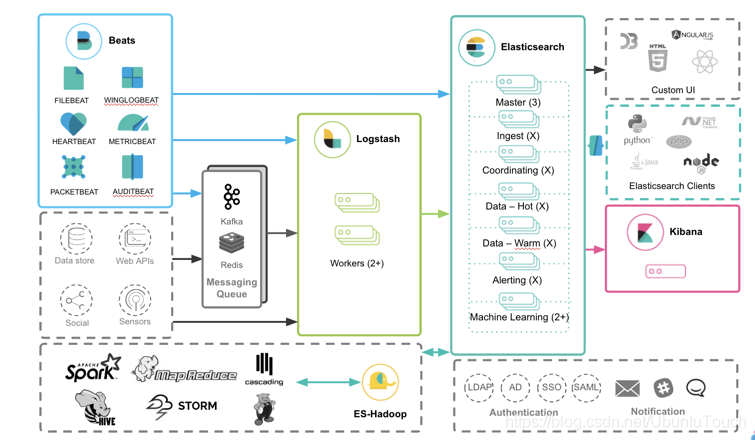

[TOC]

# ELK

## 架构设计

成熟的一些ELK架构设计如下图



选择较多的点主要集中在数据的输入一端，如果是使用 `Beats` 进行数据的收集，有三种方式可以将数据导入的 `Elasticsearch` 中

* Beats ==> Elasticsearch

  > 对于已有的系统，比如日志信息可能未按json数据格式去打印，上报到ES的数据需要在es中进行格式化处理

* Beats ==> Logstash ==> Elasticsearch

  > Logstash 所提供了强大的 filter 组合对数据流进行处理：解析，丰富，转换，删除，添加等等，这样上报到es的数据就是格式化后的数据

* Beats ==> Kafka ==> Logstash ==> Elasticsearch

  > 如果数据流具有不确定性，比如可能在某个时刻生产大量的数据，从而导致 Logstash 不能及时处理，我们可以通过 Kafka 来做一个缓存，也可以避免 logstash 丢失日志数据

## Beats -> Kafka -> Logstash -> Elasticsearch架构收集nginx access日志

用来收集`nginx`的`access.log`的日志，在es中生成的索引规则为 `nginx-access-test-%{+YYYY-MM-dd}`

### 部署

目前在联调环境，搭建了一套每个服务都是单节点的 ELK 完整体系。目前部署的版本都是`6.6.2` 版本

#### Filebeat

`192.168.180.177` `/export/elk/filebeat-6.6.2-linux-x86_64`

启动： `./filebeat -e -c filebeat.yml`

#### LogStash

`192.168.180.177` `/export/elk/logstash-6.6.2`

启动： `bin/logstash -f logstash.conf`

#### Kafka

`192.168.180.176` `/home/cloud-user/kafka_2.11-1.1.0/kafka_2.11-1.1.0`

#### Elasticsearch

`192.168.180.176` `/export/elk/elasticsearch-6.6.2`

启动： `bin/elasticsearch`

访问： http://192.168.180.176:9200

#### Kibana

`192.168.180.176` `/export/elk/kibana-6.6.2-linux-x86_64`

启动：`./bin/kibana`

访问： http://192.168.180.176:5601

### 服务代码

#### 指定时间范围内请求数累计top

```json
{
    "startTime": "2021-09-07 16:30:00",
    "endTime": "2021-09-07 17:30:00",
    "numOfTop": 10 
}

{
	"data": [
		{
			"count": 8,
			"url": "/datasync/app/data/getMsgStatus"
		},
		{
			"count": 4,
			"url": "/hardware/device/lowPower/query/16"
		},
		{
			"count": 1,
			"url": "/hardware/device/lowPower/query/"
		},
		{
			"count": 1,
			"url": "/hardware/device/lowPower/update"
		}
	],
	"retInfo": "success",
	"retCode": 20000
}
```

> numOfTop: 请求数累计top多少

#### 指定时间范围下，特定请求，特定参数访问次数

```
在指定时间段，接口 /managecenter-api/login 入参包含 admin@uplus.com 调用的次数,按请求是否成功进行统计

{
    "startTime": "2021-09-07 16:30:00",
    "endTime": "2021-09-07 17:30:00",
    "url": "/managecenter-api/login",
    "content": "admin@uplus.com"
}

{
	"data": [
		{
			"count": 7,
			"status": 200
		}
	],
	"retInfo": "success",
	"retCode": 20000
}
```


## Filebeat -> es 收集分布式部署服务日志

可以实现对分布式部署的服务日志收集，便于日志查看

### 部署

#### Filebeat

`192.168.180.125` `/export/elk/filebeat-6.6.2-linux-x86_64`

启动： `./filebeat -e -c filebeat.yml`

#### Elasticsearch

`192.168.180.176` `/export/elk/elasticsearch-6.6.2`

启动： `bin/elasticsearch`

访问： http://192.168.180.176:9200

#### Kibana

`192.168.180.176` `/export/elk/kibana-6.6.2-linux-x86_64`

启动：`./bin/kibana`

访问： http://192.168.180.176:5601

## Gateway -> filebeat -> kafka -> 服务 -> es 通过网关收集操作日志

通过filebeat收集gateway的操作日志信息，将日志信息输入到kafka中，服务从kafka中获取到日志信息，并反填接口名、操作人邮箱、操作人电话、操作人名称等等信息，以月为单位创建索引，存入es

### 部署

#### kafka

`192.168.180.176` `/home/cloud-user/kafka_2.11-1.1.0/kafka_2.11-1.1.0`

启动： `bin/kafka-server-start.sh -daemon config/server.properties`

访问： `192.168.180.176:9092`

#### 服务

见工程代码

