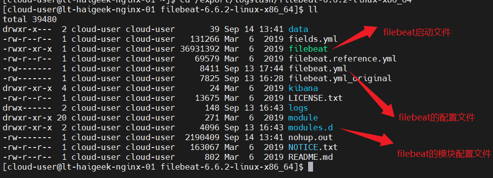
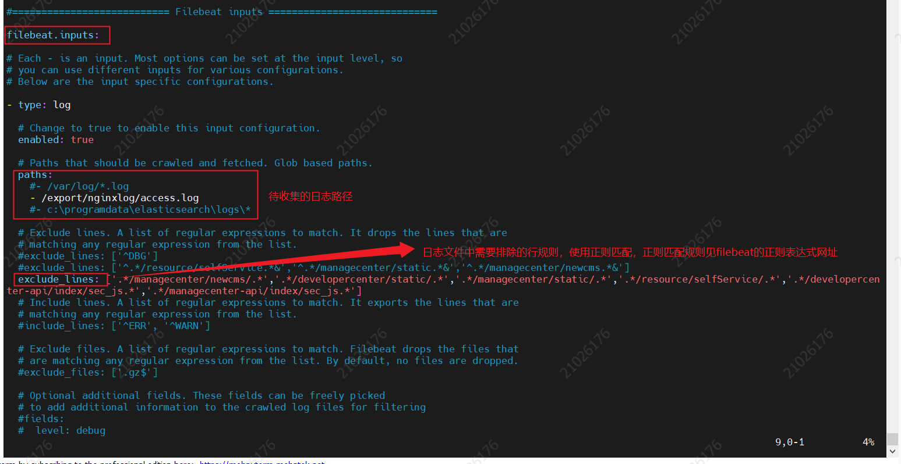
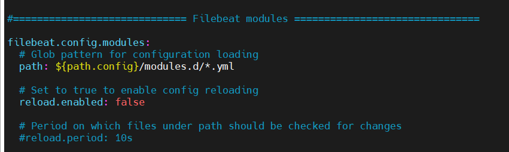
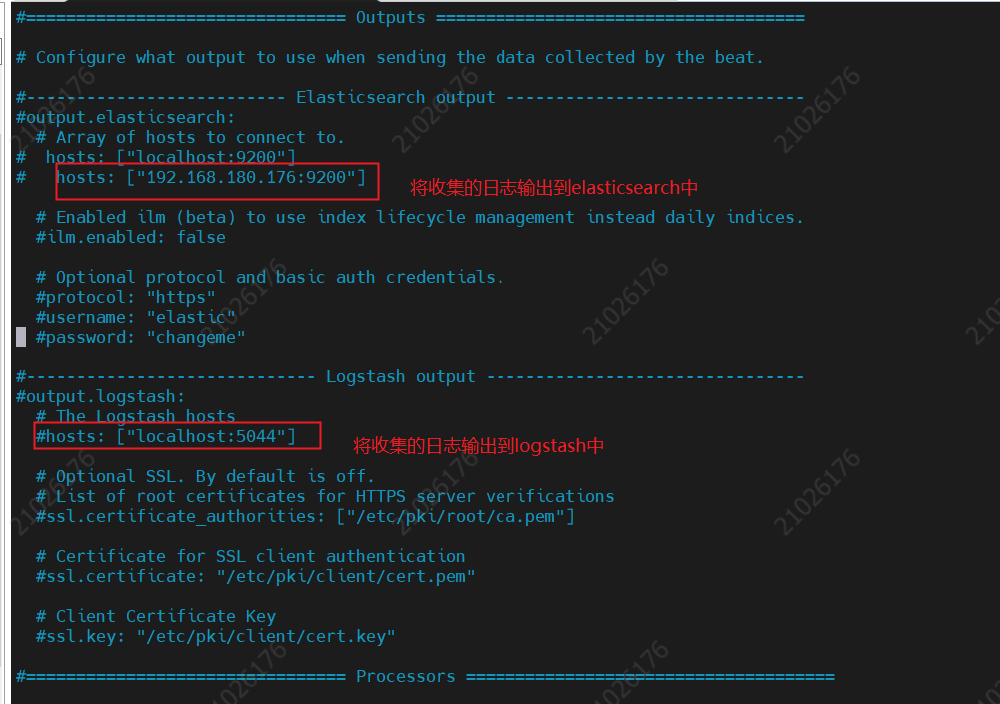
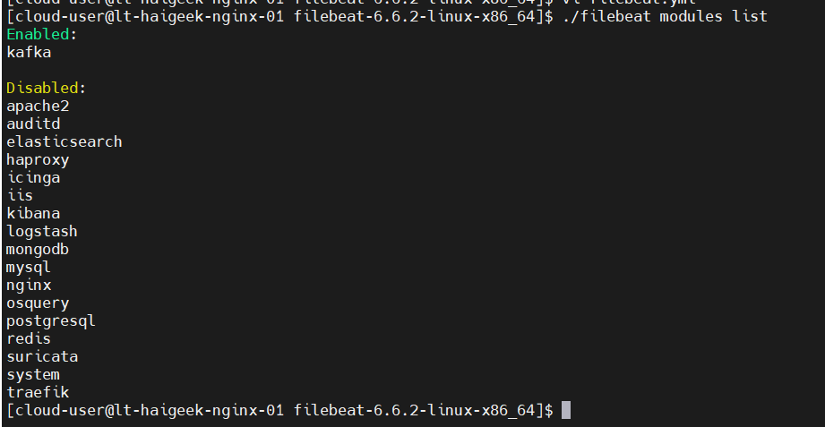

[TOC]

[TOC]

# FileBeat

> basic 6.2version

## 介绍

`ELK`的架构中，首先第一步是进行日志收集，在Elastic公司，有一个开源数据传送器[Beats](https://www.elastic.co/guide/en/beats/libbeat/6.2/beats-reference.html),可以将其作为agent安装在服务器上，以将不同类型的操作数据发送到`Elasticsearch`中;


可以看到Beat有多种类型，不同类型的beat收集不同类型的操作数据

- **[packetbeat](https://www.elastic.co/downloads/beats/packetbeat)** 网络数据包分析器，它传送有关应用程序服务器之间交换的事务的信息
- **[Metricbeat](https://www.elastic.co/downloads/beats/metricbeat )** 是一个服务器监控代理，它定期从服务器上运行的操作系统和服务收集指标
- **[filebeat](https://www.elastic.co/downloads/beats/filebeat)** 侧重于收集日志型信息

## 优势

与`logstash`都有日志收集功能，但是相比`logstash`更轻量，占用资源更少，可以说是 logstash 衍生服务

## 如何工作

当启动 Filebeat 时，它会启动一个或多个prospectors，这些prospectors会查看配置文件中指定的日志目录。对于prospector找到的每个日志文件，Filebeat 都会启动一个harvester。每个收割机读取新内容的单个日志文件，并将新日志数据发送到 libbeat，后者聚合事件并将聚合数据发送到您为 Filebeat 配置的输出。


## 官方文档

[doc](https://www.elastic.co/guide/en/beats/filebeat/6.2/filebeat-overview.html)

## 安装

### Download

[根据服务器类型选择相应的安装包及想要的版本](https://www.elastic.co/cn/downloads/beats/filebeat)

### Configuration



下载需要的filebeat安装包，解压后如上图所示

其中filebeat的相关配置主要是关注文件 `filebeat.yml` 及文件夹 `modules.d`

`filebeat.reference.yml`是较全的配置模板文件，可以从中找到想要功能的配置方法

#### Filebeat.yml

##### [Regular Expression Support](https://www.elastic.co/guide/en/beats/filebeat/6.2/regexp-support.html)

##### Filebeat Inputs



下述为一个基本的input配置下述为一个基本的input配置

 ```properties
 filebeat.inputs:
 # Each - is an input. Most options can be set at the input level, so
 # you can use different inputs for various configurations.
 # Below are the input specific configurations.
 - type: log
   # Change to true to enable this input configuration.
   enabled: true
   paths:
     - /apps/paas/services/OPEN_PLATFORM_managecenter_30200_0/logs/catalina.*.out
     - /apps/paas/services/OPEN_PLATFORM_developercenter_api_30000_0/logs/catalina.*.out
   # 需要排除的行数据，支持正则表达式匹配
   exclude_lines: ['.*/managecenter/newcms/.*','.*/developercenter/static/.*','.*/managecenter/static/.*','.*/resource/selfService/.*','.*/developercenter-api/index/sec_js.*','.*/managecenter-api/index/sec_js.*'] 
 
 # 日志中一般会出现类似异常堆栈，或者打印信息换行的情况，为了保持完整的一条日志记录，需要对行进行合并，如下配置
   # multiline.pattern 定义的正则表达式
   multiline.pattern: '^[0-9]{2}:[0-9]{2}:[0-9]{2}.[0-9]{3}'
   # 上面定义的正则表达式，匹配成功之后为一条数据的起始点则设置为true，反之为false
   multiline.negate: true
   # 基准行如果跟后续未匹配的合并，则配置未after，如果跟之前的行合并，则配置未before
   multiline.match: after
 ```

| Setting for `negate` | Setting for `match` | Result                                                       | Example `pattern: ^b`                                        |
| -------------------- | ------------------- | ------------------------------------------------------------ | ------------------------------------------------------------ |
| `false`              | `after`             | Consecutive lines that match the pattern are appended to the previous line that doesn’t match. |  |
| `false`              | `before`            | Consecutive lines that match the pattern are prepended to the next line that doesn’t match. |  |
| `true`               | `after`             | Consecutive lines that don’t match the pattern are appended to the previous line that does match. |  |
| `true`               | `before`            | Consecutive lines that don’t match the pattern are prepended to the next line that does match. |  |

##### Filebeat Modules



##### Processor

```properties
processors:
  #- add_host_metadata:
  #   netinfo.enabled: false
  #- add_cloud_metadata: ~
  - drop_fields:
     # 配置不需要收集的字段，filebeat默认会收集机器参数等信息
     fields: ["log","input","beat","prospector","offset","source","host"]
```

##### Output

目的地可以为

- [Elasticsearch](https://www.elastic.co/guide/en/beats/filebeat/6.2/elasticsearch-output.html)
- [Logstash](https://www.elastic.co/guide/en/beats/filebeat/6.2/logstash-output.html)
- [Kafka](https://www.elastic.co/guide/en/beats/filebeat/6.2/kafka-output.html)
- [Redis](https://www.elastic.co/guide/en/beats/filebeat/6.2/redis-output.html)
- [File](https://www.elastic.co/guide/en/beats/filebeat/6.2/file-output.html)
- [Console](https://www.elastic.co/guide/en/beats/filebeat/6.2/console-output.html)
- [Output codec](https://www.elastic.co/guide/en/beats/filebeat/6.2/configuration-output-codec.html)
- [Cloud](https://www.elastic.co/guide/en/beats/filebeat/6.2/configure-cloud-id.html)



###### es

```properties
output.elasticsearch:
  # Array of hosts to connect to.
  hosts: ["http://192.168.180.176:9200"]
  # 定义索引的名称,每天一个索引，这个时候，得有@timestamp字段
  index: "union-192.168.180.125-%{+yyyy-MM-dd}" 
setup.template.name: "union-192.168.180.125"
setup.template.pattern: "union-192.168.180.125-*"
```

###### kafka

```properties
output.kafka:
  codec.format:
    #string: '%{[@timestamp]} %{[message]}'
    string: '%{[message]}'
  hosts: ["192.168.180.176:9092"]
  # 需要将数据传入指定topic
  topic: apache-demo
  partition.round_robin:
    reachable_only: false
  required_acks: 1
  compression: gzip
  max_message_bytes: 1000000
```

#### Modules.d

该模块是可选的，提供的是多种快速开始处理场景日志格式的方法；

有三种种启用的方式


常用的一些启停模块命令

* 查看modules列表

  ```shell
  ./filebeat modules list
  ```

  



* 启用指定modules

  ```shell
  ./filebeat modules enable apache2 mysql
  ```

  

* 停用指定modules

  ```shell
  ./filebeat modules disable apache2 mysql
  ```

### Run

配置完成后即可启动服务

```shell
./filebeat -e -c filebeat.yml
```

## Q&A

## 启动时报错 Error loading pipeline: Error loading pipeline for fileset nginx/access:

**背景**：

走 filebeat => es流程，将通过filebeat的收集的数据直接输入到es中

**报错信息**：

```
2021-09-10T10:14:19.515+0800    ERROR   fileset/factory.go:142  Error loading pipeline: Error loading pipeline for fileset nginx/access: This module requires the following Elasticsearch plugins: ingest-user-agent, ingest-geoip. You can install them by running the following commands on all the Elasticsearch nodes:
    sudo bin/elasticsearch-plugin install ingest-user-agent
    sudo bin/elasticsearch-plugin install ingest-geoip
```

**解决办法：**

是因为`Elasticsearch`少了两个插件，需要给`ES`安装提示的插件

* 下载如下两个插件

```shell
https://artifacts.elastic.co/downloads/elasticsearch-plugins/ingest-user-agent/ingest-user-agent-6.6.2.zip
https://artifacts.elastic.co/downloads/elasticsearch-plugins/ingest-geoip/ingest-geoip-6.6.1.zip
```

* 离线安装

```shell
bin/elasticsearch-plugin install file:///usr/local/src/ingest-geoip-6.6.1.zip
```

> file:// 前缀必须要加

