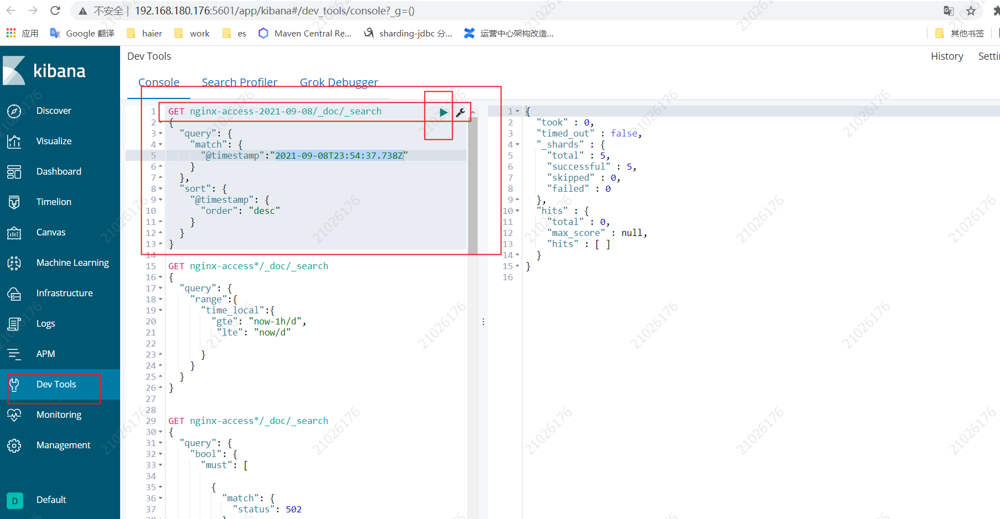

[TOC]

# Kibana

> basic version 6.6.2

## 介绍

Kibana is an open source analytics and visualization platform designed to work with Elasticsearch. You use Kibana to search, view, and interact with data stored in Elasticsearch indices. You can easily perform advanced data analysis and visualize your data in a variety of charts, tables, and maps.

Kibana makes it easy to understand large volumes of data. Its simple, browser-based interface enables you to quickly create and share dynamic dashboards that display changes to Elasticsearch queries in real time.

## 优势

原生集成了ELK技术栈，安装简单，使用方便、对用户很友好;

社区活跃

可以进行日志的实时滚动查看,类似linux的`tail -f`

可以在页面进行各种日志汇总操作，并且生成对应的图标信息

## 官方文档

[doc](https://www.elastic.co/guide/en/kibana/6.2/introduction.html)

### 工具

#### dev tools



### Visual 

#### Defining index pattern

[doc](https://www.elastic.co/guide/en/kibana/6.2/tutorial-define-index.html#tutorial-define-index)


#### Discovering data

[doc](https://www.elastic.co/guide/en/kibana/6.2/tutorial-discovering.html)

查看某个时间段内指定index pattern的数据; 

[自定义数据过滤规则](https://www.elastic.co/guide/en/kibana/6.2/search.html); 采用`lucene` 或者 `elasticsearch query dsl` 语法进行过滤

[自定义字段过滤](https://www.elastic.co/guide/en/kibana/6.2/field-filter.html);

自定义数据刷新规则;

自定义数据导出;


#### Visualizing data

[doc](https://www.elastic.co/guide/en/kibana/6.2/visualize.html)

图形化汇总数据;

折线,饼状,表格....


#### Dashboard with visualizing

[doc](https://www.elastic.co/guide/en/kibana/6.2/tutorial-dashboard.html)

可以展示 visualize 集合


## [安装](https://www.elastic.co/cn/downloads/kibana)

linux系统离线安装步骤：

* 下载`tar.gz`类型的包,到想要目录进行解压
* 修改 `config/kibana.yml` 配置文件; `server.host` `server.port`访问地址,`elasticsearch`访问地址...
  * 启动 `./bin/kibana` 即可
  
  * 7.x以上的版本kibana可以设置语言为中文，
  
    ```properties
    i18n.locale: "zh-CN"
    ```

* 启动

  `./bin/kibana`

## Q&A

