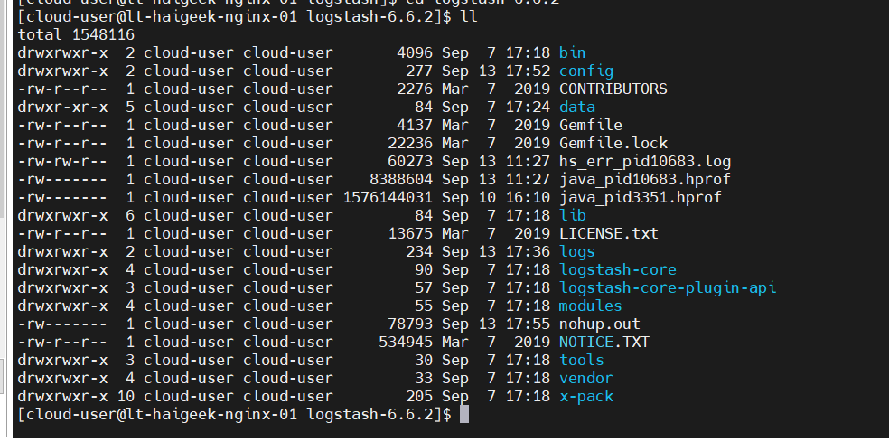
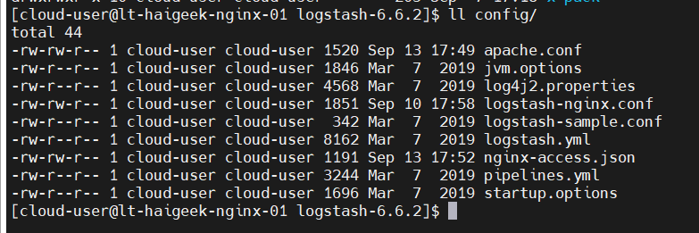

[TOC]

# LogStash

## 介绍

`ELK`的架构中，首先第一步是进行日志收集，而`logStash`就是`ELK`中的`L`，是一个开源数据收集引擎，具有实时功能

可以动态统一来自不同来源的数据，并将数据规范化为您选择的目的地。为各种高级下游分析和可视化用例清理和格式化数据

## 优势

完善的规范化不同来源的数据功能

社区活跃，同时已经超过200+的可用插件

## 如何工作

logstash把一条数据输入到输出称为一个事件，事件处理逻辑可以分为三个阶段

### input

将数据导入`logstash`,[数据来源模块很多](https://www.elastic.co/guide/en/logstash/6.2/input-plugins.html)，如 file、beats、kafka...

### filter

中间过程，可以配置特定的条件，对input的数据进行特定处理；其中有多种插件可以配置进行处理[Filter Plugins](https://www.elastic.co/guide/en/logstash/6.2/filter-plugins.html)

#### grok

解析和构造任意文本。将输入的非结构化日志数据解析为结构化和可查询的最佳方式

#### mutate

对事件字段执行一般转换。比如重命名、删除、替换和修改字段

...

### output

将数据输出到指定的模块，可以指定多个模块；输出完成，一个事件也就宣告结束 [Output Plugins](https://www.elastic.co/guide/en/logstash/6.2/output-plugins.html)


## 官方文档

[doc](https://www.elastic.co/guide/en/logstash/6.2/introduction.html)

## 安装

### Download

[根据服务器类型选择相应的安装包及想要的版本](https://www.elastic.co/cn/downloads/logstash)

### Configuration

下载需要的安装包后，解压即可



其中`config`目录下就是服务可选的配置文件，需要的一些配置可用在里面进行配置



默认的配置文件包括

`jvm.options` 服务jvm相关参数

`log4j2.properties` 日志配置文件

`logstash-sample.conf` 简单的一个input->filter->output配置示例

`logstash.yml` logstash运行的参数配置，配置文件的位置、日志...

`pipelines.yml` 多个管道配置示例

`startup.options` 服务启动参数配置

#### 示例1

以下为以联调环境nginx的access.log日志为输入日志，进行收集，将收集到的日志以json的形式打印在控制台的示例

nginx的日志配置格式如下

```nginx
log_format  main  '$remote_addr [$time_local] "$request" '
                      '$status $body_bytes_sent "$http_referer" '
                      '"$http_user_agent" "$http_x_forwarded_for" "$request_body" '
                      '"$upstream_addr" "$upstream_status" "$upstream_response_time" "$request_time"';
```

logstash-nginx.conf

```nginx
input {
    file {
        path => "/export/nginxlog/access.log"  #日志文件路径
    }
}

filter {
    grok {
        match => ["message","%{IPORHOST:remote_addr} \[%{HTTPDATE:time_local}\] \"(?:%{WORD:method} %{NOTSPACE:request}(?: HTTP/%{NUMBER:httpversion})?|%{DATA:rawrequest})\" %{NUMBER:status} (?:%{NUMBER:body_bytes}|-) %{QS:referrer} %{QS:user_agent} %{QS:x_forward_for} %{QS:request_body} %{QS:upstream_addr} %{QS:upstream_status} %{QS:upstream_response_time} %{QS:request_time}"]
        remove_field => ["message",'@timestamp']
}
}

output {
    stdout {
        codec=>rubydebug   #屏幕输出调试
    }
}
```

Console output

```json
{
                  "referrer" => "\"https://www.haigeek.com/managecenter/newcms/maincms.html\"",
               "remote_addr" => "117.22.229.83",
              "request_time" => "\"0.041\"",
                    "method" => "POST",
                      "host" => "lt-haigeek-nginx-01",
             "x_forward_for" => "\"-\"",
             "upstream_addr" => "\"192.168.180.125:8090\"",
                  "@version" => "1",
    "upstream_response_time" => "\"0.040\"",
                "body_bytes" => "609",
              "request_body" => "\"{\\x22pageNum\\x22:1,\\x22pageSize\\x22:20}\"",
                "time_local" => "08/Sep/2021:14:33:08 +0800",
                      "path" => "/export/nginxlog/access.log",
                    "status" => "200",
               "httpversion" => "1.1",
                "user_agent" => "\"Mozilla/5.0 (Windows NT 10.0; Win64; x64) AppleWebKit/537.36 (KHTML, like Gecko) Chrome/92.0.4515.159 Safari/537.36\"",
           "upstream_status" => "\"200\"",
                   "request" => "/managecenter-api/openservice/servicecenter/v1/service"
}
```

#### 示例2

收集kafka中的数据

logstash处理kafka中的数据，而kafka中的数据，仍旧来源于nginx_access.log

```properties
input {
  kafka {
    bootstrap_servers => "192.168.180.176:9092"
    topics => "apache-demo"
    }
}

filter {
    grok {
        match => ["message","%{IPORHOST:remote_addr} \[%{HTTPDATE:time_local}\] \"(?:%{WORD:method} %{NOTSPACE:request}(?: HTTP/%{NUMBER:httpversion})?|%{DATA:rawrequest})\" %{NUMBER:status} (?:%{NUMBER:body_bytes}|-) %{QS:referrer} %{QS:user_agent} %{QS:x_forward_for} %{QS:request_body} %{QS:upstream_addr} %{QS:upstream_status} %{QS:upstream_response_time} %{QS:request_time}"]
       remove_field => ['message','upstream_status','httpversion','user_agent','@version','x_forward_for','body_bytes','upstream_response_time','path','referrer']
    }
    # 删除冗余的数据行，也就是document的request字段，能匹配到这个正则之后，这个document就不输入到es
    #if [request] =~ "^\/developercenter\/static" {
	#	drop {}
	#}
   
   date {
       match => ["time_local","dd/MMM/yyyy:HH:mm:ss Z"]
       target => "time_local"
       timezone => "Asia/Shanghai"
   }
   geoip {
       source => "clientip"
   }

	# 对数据进行处理，字段内容的替换
    mutate{
        gsub => [
       		"request_body","\\x22","\"",
        	"upstream_addr","\"","",
        	"request_time","\"",""
        ]
    }

	# 字段类型的转换
    mutate {
        convert =>{
            "status" => "integer"
            "request_time" => "float"
        }
    }

}

output {
   elasticsearch {
        hosts => ["192.168.180.176:9200"]
        index => "nginx-access-test-%{+YYYY-MM-dd}"
        # 自定义index template
        template => "/export/elk/logstash-6.6.2/config/nginx-access.json"
        template_name => "nginx-access"
        template_overwrite => true
   }
}
```


### Run

配置完后，即可使用命令启动服务

```shell
bin/logstash -f logstash.conf
```

`-f` 后跟自定义的 管道配置文件


## Q&A

### 定义使用正则

logstash 默认已经配置了很多正则表达式，可以直接使用，正则配置的位置在  `/vendor/bundle/jruby/2.3.0/gems/logstash-patterns-core-4.1.2/patterns`

